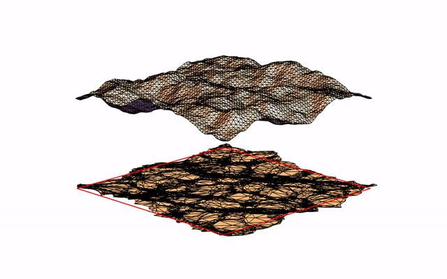

# Periodic Caustic Textures

## Description
generating periodic caustics pattern in space and time

## Algorithm Overview
random (fractal) surface profile by filtering three-dimensional noise by a power law-like filter in space and a Gaussian-like filter in time
1. random height field generation based on frequency synthesis
  * create a random noise signal
  * apply the fast Fourier transform to transfer the data into the frequency domain and apply the 1/f filter
  * transform it back to the spatial domain with an inverse fast Fourier transform
2. smoothing in time with Gaussian filter
3. projection of the resulting surface to the ground plane – assuming directional light source pointing at this surface, computation of the intersection of the refracted rays with a plane at some depth – visualization with additive blending, triangle intensity is inversely proportional to the area of the projected triangle

## References
 * [Periodic Caustic Textures by Jos Stam](www.dgp.toronto.edu/~stam/reality/Research/PeriodicCaustics/index.html)
 * [Frequency Synthesis of Landscapes (and clouds) by Paul Bourke](http://paulbourke.net/fractals/noise/)
